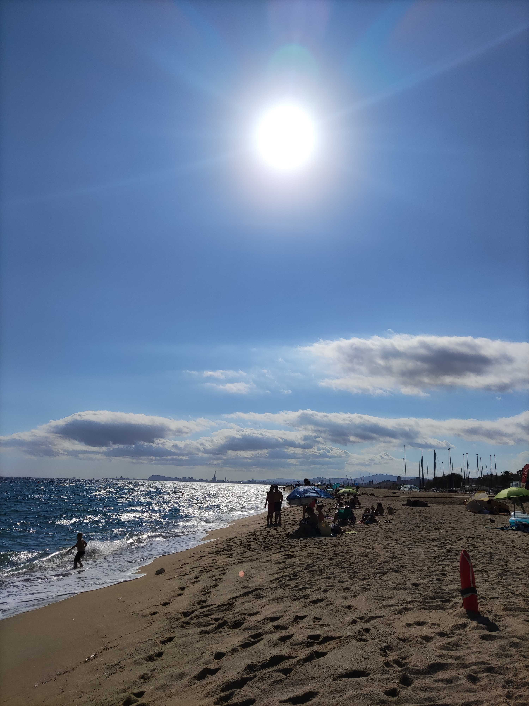
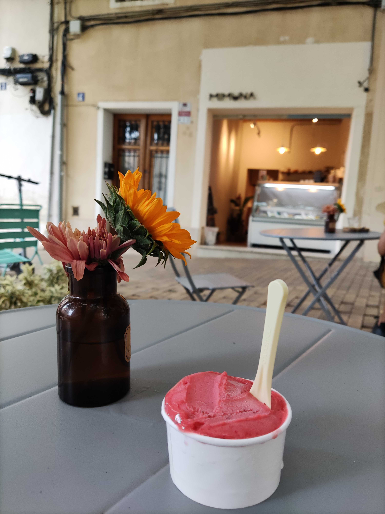
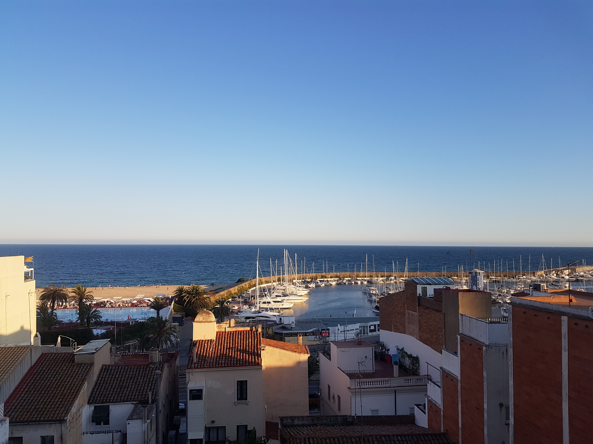
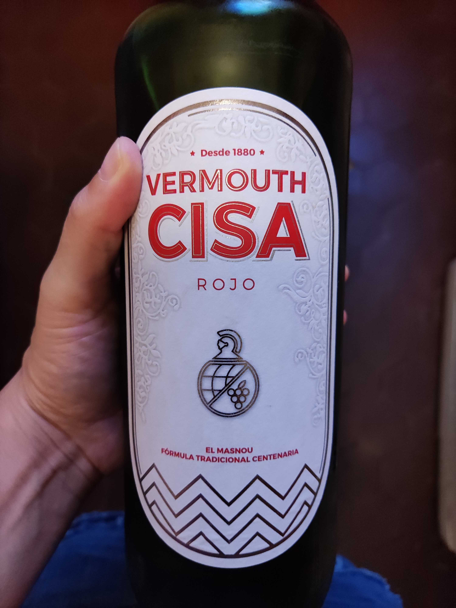

There are a lot of beach towns close to Barcelona that are easily reachable by train. Suppose you'd like to escape the city and go to a more local small beach town I recommend taking the train to El Masnou. It's a beach towns near Barcelona by train, 30 min away to be specific. You would only need a zone 2 train ticket. The train ride is beautiful as it goes along the Maresme coast.

## Why would you choose to go to El Masnou?

You'll find a few sandy and wide beaches filled mostly with locals, Ocata being my favorite, chiringuitos (beach bars), artisanal coffee, the best vermouth in Catalunya, plenty of restaurants in the Port as well as specialty coffee. This town might seem small but it has everything one would need for a day trip outside.

## How to get to Masnou and Ocata

The easiest way would be taking the train R2 from any of these stations in Barcelona: Sans, Plaça Catalunya, Arc de Triumf, Clot and get off either in Masnou or Ocata depending on the beach you'd like to spend the day at. The train stations are 10-15 min walk from each other.

You could also get there by car take the C-32 highway with no toll and arrive in about 30 minutes. I won't recommend this as it will be ready hard to find parking. If you take a get here by motorbike than you won't have a problem parking.

## What to do in Masnou / Ocata?

<b class="primaryColor">
1. Enjoy the beach and maybe do some (sunrise) paddle surf!</b>

My favorite is Platja d'Ocata as it is wider and there are more Chiringuitos. If you'd like to paddle plan it's best to go at the Platja del Masnou as you can rent a board at <a href="https://www.maresmewaves.com/contacto/" target="_blank" class="articleLink">Maresme Waves</a>.

Depending on which beach you choose get off either at El Masnou or Ocata stop.

 

 

<b class="primaryColor">
2. Get ice cream, ideally from Mimuna
</b>

Just 5-10 min away from the beach this is the perfect thing to do after a day at the beach. At Mimuna you'll get homemade ice cream and can find plenty of vegan options.

 

<b class="primaryColor">
3. Grab a coffee at Verde Aceituna
</b>

If you're like me and are into specialty/roastery this is the place to go. Keep in mind they are closed on Sundays.

<b class="primaryColor">
4. Get a picture of the town at Mirador de l'església de Sant Pere

</b>

 
<b class="primaryColor">
5. Try out one of the best vermouths from Catalunya. (you can order it also online.)
</b>

 
 

## Where to eat in Masnou / Ocata?

- Burgers ideally at Picaña hamburgueseria. They have vegan and vegetarian options!

- Pizza, pasta and more Italian food at La Pizza di Piero. Try out the lasagna de setas (mushrooms), it's delicious!

- Paella at Restaurante La Santa in the harbour.

You can find these plus other options on the map below. Also, there are many more options are available in the harbor as well as on the main road. It's better to reserve in advance even on the same day.

    <iframe src="https://www.google.com/maps/d/u/0/embed?mid=1KW7iIir64-Nu_mXh6W9mrZIAWSWjgh0&ehbc=2E312F" width="640" height="480"></iframe>

