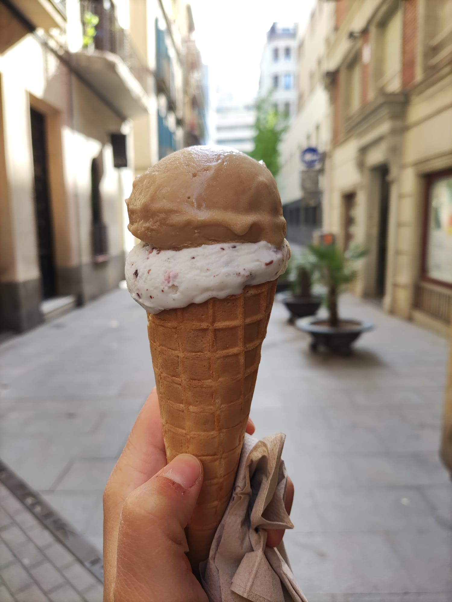

With summer just around the corner it was time to put together this list including some of the ice cream I ate in Barcelona. Whether you are visiting Barcelona or you live here and you want to get some good ice cream these places are a must-try.

Get the google map <a href='https://www.google.com/maps/d/viewer?mid=1v9pdv7vsfMiQct1UY5CHAvmP7zWxFNM&ll=41.39321318240926%2C2.1799373499999852&z=15' target='_blank'>here.</a>

<iframe src="https://www.google.com/maps/d/embed?mid=1v9pdv7vsfMiQct1UY5CHAvmP7zWxFNM&ehbc=2E312F&noprof=1" width="640" height="480"></iframe>

## <a href='https://maps.app.goo.gl/j7nZvtQhqJbhDpWe8' target="_blank">1. Gianduia - Gothic Quarter</a>

It's not that easy to rank ice creams but I'd say this is in the top top. It's a small italian ice cream spot minutes away from the Cathedral. Here you'll find Italian 🇮🇹 ice cream and a very friendly owner.

## <a href='https://maps.app.goo.gl/nhUnVweVazw8YxwCA' target="_blank">2. La Lletera Barcelona de Gràcia Helados Artesanos</a>

As the title mentions it this place is in Gracia and could be an option if you're walking down from Park Guell or Casa Vincents. If you fancy trying out something new order the Orxata, also known as horchata outside of Catalunya, is a traditional Spanish drink made from ground almonds, sesame seeds, rice, or tigernuts, sweetened and flavored with cinnamon. This drink is originally from Valencia.

## <a href='https://goo.gl/maps/KtHcvJYQSPGogBmi7' target="_blank">3. Paral·lelo Gelato - Eixample</a>

This used to be one of my favorite places but last time I tried I found it a bit too sweet. Nonetheless it's great and they have a lot of flavours to try from including vegan options. A cool thing they do here is allowing you to order a small cone with 2 half flavours.

## <a href='https://maps.app.goo.gl/uo8Md9Sjg13BGBEq6' target="_blank">4. Morreig - in Gracia</a>

This is ice cream shop is easy to miss as there is no big sign. It's close to the Cinema Verdi where they play movies also in their original language. Located on Carrer Verdi which is a pedestrian street in Gràcia you might want to check out.

## <a href='https://maps.app.goo.gl/fi29vFoFZcw6s5uW7' target="_blank">5. Gelaaati Di Marco - Gothic Quarter</a>

This is an Italian ice cream shop in the city center that at first I thought would be a tourist trap. After giving it a try I can say this is good ice cream. The staff is really friendly and they have interesting flavours.

## <a href='https://maps.app.goo.gl/wp9KVTMaPQWhdqsYA' target="_blank">6. La Glace BCN - Ciutadella Park</a>

Minutes away from the Arc de Triomf and close to the Parc de Ciutadella if you fancy getting some ice cream.

## 7. Amorino

This is not specific small business type of ice cream shop from Barcelona but rather a chain of ice cream shops that I first tried in Sevilla and liked. They'll shape your ice cream as a rose and it's a bit more expensive than the other places. You'll find a few in the area of Las Ramblas.

## <a href='https://maps.app.goo.gl/9HmyDmyTWJgDu3Y48' target="_blank">8. Gocce di latte - El Born</a>

This place is perfect after a day at the beach in case you choose to go to Barceloneta or walk around El Born.

## <a href='https://maps.app.goo.gl/diaPfDkftCg9cpo76' target="_blank">9. Gelats amb Sol AURELIEN.BARCELONA</a>

This is another ice cream spot in Gracia. Located in the Plaça del Sol it's a cool place to check out and see young people sitting on the floor talking, playing instruments, having a drink etc.

## <a href='https://maps.app.goo.gl/qRp1E8HnFzYsMAjp9' target="_blank">10. La gelateria de Leonardo - Poble Nou</a>

Small and good! Since I stopped working in Poble Nou I haven't been in that area that much which I guess is why I don't have that many recommendations. As a tourist you might not wonder that much there but if you have time go, food is good and the neighborhood is pretty cool too.

## <a href='https://maps.app.goo.gl/h3PjsXEP58DsooMP9' target="_blank">11. DeLaCream - Eixample</a>

Popular ice cream spot in the middle of Eixample on one street that I really like which is filled with restaurants, C. d'Enric Granados. There tends to be a line around this shop. They opened one also close to Arc the Triumf. I've tried it, not a fan but I guess people lining up for it must do it for a reason so if you are in the area and don't mind the wait give it a try.

## <a href='https://maps.app.goo.gl/jNKD5kUr6UT2zQA1A' target="_blank">12. MAMÁ HELADERA - Poble Nou</a>

I haven't tried this one but it's on my list. If you do try it let me know if it's any good. It's have 4.9 stars on Google Reviews as per writing this article.

## <a href='https://goo.gl/maps/46AHFHkZR6oeUPN8A' target="_blank">13. AMMA Gelato - Gracia</a>

I'm not a fan but if you want to get a vegan ice cream everything flavor here is vegan. I had vanilla and it was too sweet.
