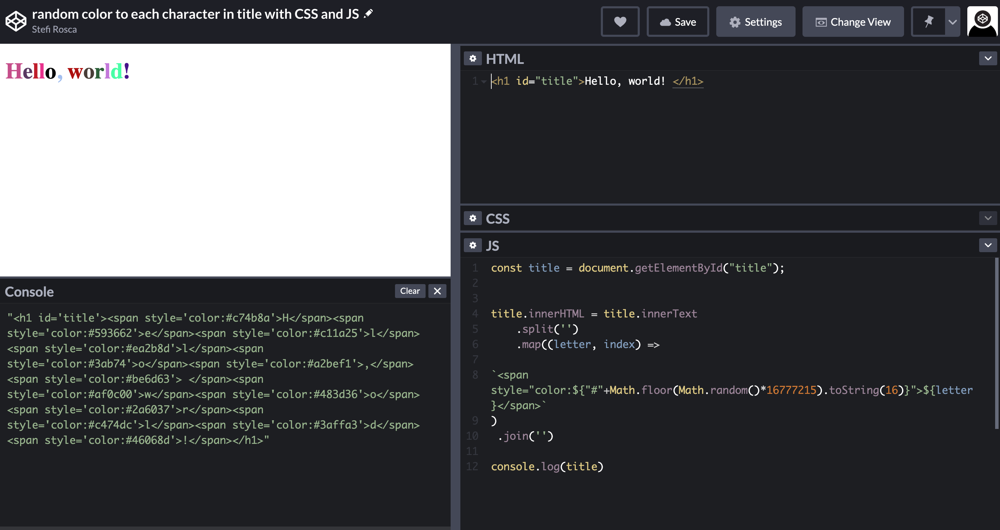
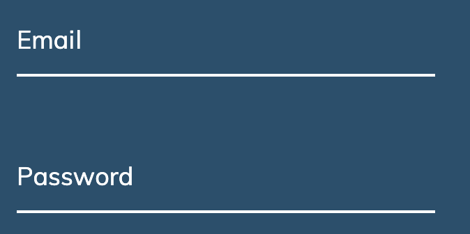
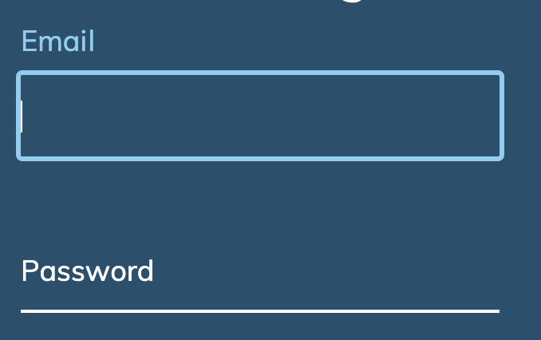

I'm following <a style="color: #942874; text-decoration:underline" target="blank" href="https://twitter.com/florinpop1705">Florin Pop</a> and <a style="color: #942874; text-decoration:underline" target="blank" href="https://twitter.com/traversymedia">traversymedia</a> 50 Javascript, HTML, and CSS tutorials on Udemy. This is a great way to put into practice CSS properties I've learned but use rarely as well as do refresh some JavaScript DOM manipulation concepts.
While going through the form-input-wave tutorial I got a better understanding on how some of the display properties work (inline, inline-block and block). I might write about this soon so do check back.

Here are the 3 main takeaways:

1. How one can create a span for each character of a word.

Simply by using the array split method from JS and adding the span around the element and then joining the word back using the join method, voila :) Here's the example of it:

<pre class="line-numbers" style="background: #352d39; color:#e3f4f5; font-family: Open Sans,sans-serif;">
  <code class="language-markdown">
 &lt;h1 class="title" id="title"&gt;Hello, world!&lt;/h1&gt;  
 &lt;script&gt;
    const title = document.getElementById("title");
	title.innerHTML = title.innerText
     .split('')
     .map((letter, index) => 
  		`&lt;span 
              style="color:${"#"+Math.floor(Math.random()*16777215)
                .toString(16)}"&gt;${letter}&lt;/span&gt;`)
 			    .join('')
 &lt;/script&gt;
  </code>
</pre>

<pre class="line-numbers" style="width:100%; background: #352d39; color:#e3f4f5; font-family: Open Sans,sans-serif;">
  <code class="language-markdown">
 &lt;span style="color:${"#"+Math.floor(Math.random()*16777215)
 .toString(16)}"&gt;${letter}&lt;/span&gt;
  </code>
</pre>

To make more of sense it I added in the `span` some inline style to generate a random color. I took the random color generating code from this <a style="color: #942874; text-decoration:underline" target="blank" href="https://dev.to/akhil_001/generating-random-color-with-single-line-of-js-code-fhj">post</a>.

<b>Showcasing code with visual example:</b>

Besides this I've also learned about the propriety `pointer-events` and what happens when this is set to none.

2. What `pointer-events:none;` can be used for.

When we choose `pointer-events:none;` the element is never the target of a pointer event. The pointer will go "through" an element and target whatever is "underneath" that element instead. <a style="color: #942874; text-decoration:underline" target="blank" href="https://developer.mozilla.org/en-US/docs/Web/CSS/pointer-events">\*source</a>

This was needed as the label was initial set on the input box and it was hard to select the input otherwise. You can see that per the `position:absolute;`.

<pre class="line-numbers" style="max-width=300px; background: #352d39; color:#e3f4f5; font-family: Open Sans,sans-serif">
  <code class="language-css">
  .form-control label {
    position: absolute;
    top: 15px;
    left: 0px;
    pointer-events: none;
}
    </code>
</pre>

In the picture below one can see that the labe is on the input field which is exactly where the line is. Therefore if there would be no `pointer-events: none;` one would not be able to select with the pointer the input field when clicking on Email.

In example 2 we can see that once the field is selected the label goes up as we set it with CSS in the project. I will highlight this next.

3. Move up the label of a input field by a certain measure using the `transform` propriety.

In order to do this one would use the transform property `translateY` and give it a negative value. It's Y as it is on the Y axis and negative so it goes up.

<pre class="line-numbers" style="max-width=300px; background: #352d39; color:#e3f4f5; font-family: Open Sans,sans-serif">
  <code class="language-css">
    .form-control input:focus + label span,
    .form-control input:valid + label span {
        color: #91cbed;
        transform: translateY(-48px);
}
    </code>
</pre>

That's all for now! Thanks for reading 🙈

<a style="color: #942874; text-decoration:underline" target="blank" href="https://stefi.codes/50-JS-Projects/form-input-wave/index.html ">Project preview</a>
