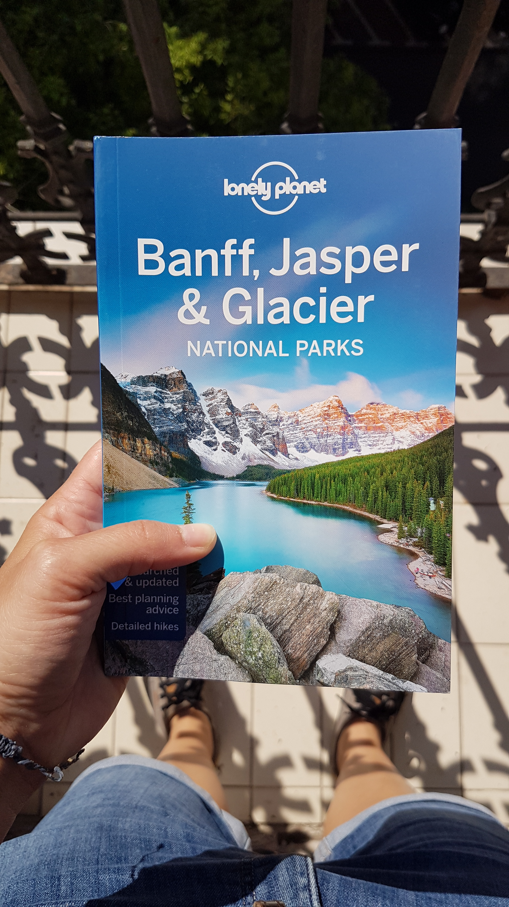

Sometime ago I watched a YouTube video called “The Bucked Shot” from @petermckinnon. I made many of my friends watch this video and watched it myself a million times. It’s not only about Banff but his touch of the story got me interested in this place.

  <iframe class="embed-responsive-item" src="https://www.youtube.com/embed/r25IWquxe9s"></iframe>

 

Later on Peter published another video called “The Mountains Won’t Remember Me” which shows the same region.

  <iframe class="embed-responsive-item" src="https://www.youtube.com/embed/2Z0lv6qlj0Q"></iframe>

 

At this point I started thinking about planning a trip and seeing this place myself.
Days went by and as Youtube magically remembered that I’m into Banff content it recommended Johnny Harris video called “Why Canada's Mountains Feel Like Switzerland | Banff, Lake Louise, and Sunshine Village”.

You don’t know this but 3 years ago I did an exercise called: “Your Ten-Year Plan for a Remarkable Life”. Long story short, in 10 years from now I dream about living in Switzerland. Although NYC is my favorite place, Switzerland feels like the ideal plan to live with my future kids and partner.
 

  <iframe class="embed-responsive-item" src="https://www.youtube.com/embed/eOa1zbBureI"></iframe>

 

Canada was somehow this place far away about which I didn’t know that much. Now somehow the dots are being connected and it’s time to go.
Receiving this book as a gift today found my crying of joy. The book is filled with plenty of information to plan a trip. In the next few weeks I want to start building that plan. I never really properly plan a trip but given the fact that I’m unsure when this could happen I get plenty of time to do it differently and see how it goes.

You might think I’m crazy for planning something during these uncertain times. Dreaming about the future and allowing myself to believe this could happen brings me a lot of joy. At the end if I won’t make it at least I will know so much more about this magic place called Banff.

> “Thinking about tomorrow brings it closer and makes it real.
> It creates the space for possibilities, for dreams, and for new ideas.
> Today we need to stay home, but our imaginations are free to roam beyond our city walls.” - Massimo Bottura
