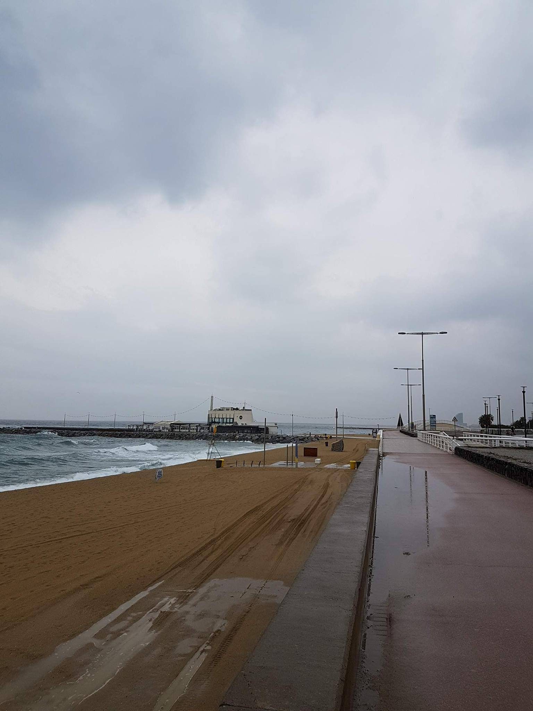

## Saturday coffee at Cafe Buho

One Saturday I was trying to get a coffee at Granja Petitbo in Barcelona. I read on a blog that it's a really good brunch place. Happily, it was full so I went across the street to this nice and cozy place called Cafe Búho. I got a coffee, did some reading and writing. It was perfect. When I got up and said I'd like to pay I've got this reply: "That's good!" Or something like that. For a moment I felt offended. It sounded as if the waiter was saying: "Oh, finally you're leaving!" So I asked: "Why?" He smiled: "It's great when people pay before they leave."

Today I had brunch there again and did my usual reading and writing. When I wanted to pay though, surprise! I had forgotten my wallet. I checked all pockets but had less than 10 euros. I went up to him and told him that I cannot pay and that I'll have to go get my wallet. I also added that I was really sorry. As if nothing happened he told me not to worry. It's all fine. Minutes after I reached home it started pouring. So now I had to wait until the rain would stop. When I got back the waiter said: "when it started to rain so badly I thought that you won't make it anymore and you will come back tomorrow." He was so relaxed about it. I apologized again and told him I wouldn't have waited a day. With his eyes twinkled he said: "Don't worry about it." 😊

If you are in Barcelona and want to have coffee go to a place where people trust you.
Such a place could be Cafe Búho.

**Update:** Cafe Buho has closed in the meantime.
