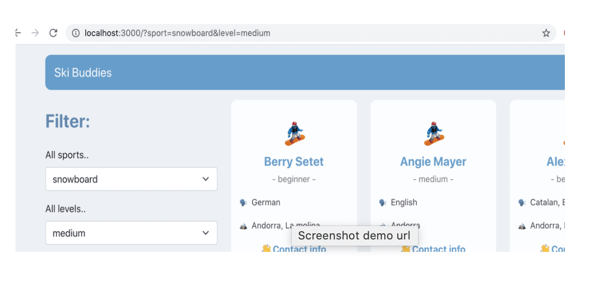

The SkiBuddies app is a web app one which one can search for skiers and snowboarders with a few filters. When doing this search I wanted the data to be shown in the URL which meant I needed to find a way to update the URL search parameters dynamically.

The URL search parameters are everything that would come after a ? 
  
Like for example in this URL: http://localhost:3000/?sport=ski&level=medium

Why did I want this? For example if someone would share the URL above I want the filters to stay set. If they would not be bound to the data it wouldn’t work. (this check I'm not talking about in this article)

In order to do this I used two hooks from the <a style="color: #942874; text-decoration:underline" target="blank" href="https://reactrouter.com/web/guides/quick-starty">React Router.</a> (The React Router was used to handle all the routing in the app): **useLocation()** and **useHistory()**

- useLocation returns the exact location you are at and the object includes besides the pathname and other information also the search params, which we need.

- useHistory is a hook that gives us access to the history instance, which we will use to navigate. It come with some methods that come in handy when working with URLs.

So how do we put it all together? 

We import from react-router-dom (which I have installed) the location and history hooks.

 <pre class="line-numbers" style="max-width=300px; width: 95%; background: #352d39; color:#e3f4f5; font-family: Open Sans,sans-serif">
<code class="language-javascript" style="max-width:100vw">
 import { useLocation, useHistory } from  "react-router-dom"
 
 let location = useLocation();
 let history = useHistory();
 
</code></pre>

Next I will use the <a style="color: #942874; text-decoration:underline" target="blank" href="https://developer.mozilla.org/en-US/docs/Web/API/URLSearchParams">URLSearchParams</a> which is a Web API. By creating grabbing the URLSearchParams we will get an object that includes methods that allow us to work with the query string of a URL. 

In my app I create a const in which I will save these search params. If you remember these are stored in the location under search. Location, the hook that we have access to inside the router. 

<pre class="line-numbers" style="max-width=300px; width: 95%; background: #352d39; color:#e3f4f5; font-family: Open Sans,sans-serif">
<code class="language-javascript" style="max-width:100vw">
 const parameters = new URLSearchParams(location.search);

</code></pre>
 
 
The **URLSearchParams.get()** method will returns the first value associated with the given search parameter.

If I would do: 
<pre class="line-numbers" style="max-width=300px; width: 95%; background: #352d39; color:#e3f4f5; font-family: Open Sans,sans-serif">
<code class="language-javascript" style="max-width:100vw">
 const sportFilter = parameters.get('sport'); 

</code></pre>

For the following URL http://localhost:3000/?sport=ski&level=medium    

=> sportFilter will be equal to ‘ski’.
 
If we would want to get the level as well, we use again the get method from the URLSearchParams. 
const levelFilter = parameters.get(‘level’); 
In this case levelFilter will be equal to medium. 

Now what do we do with this information? We can pass this information to the variables I have already declared in my React functional component, sport and level, that change these filters. 

I would do this when the component mounts and when the location changes. 

<pre class="line-numbers" style="max-width=300px; width: 95%; background: #352d39; color:#e3f4f5; font-family: Open Sans,sans-serif">
<code class="language-javascript" style="max-width:100vw">
 const [sport, setSport] = useState("")
 const [level, setLevel] = useState("") 

useEffect(() => {
 
const parameters = new URLSearchParams(location.search);
const sportFilter = parameters.get('sport');
const levelFilter = parameters.get('level');
    if (sportFilter) {
        setSport(sportFilter)
    }
    if (levelFilter) {
        setLevel(levelFilter)
    }

   }, [location]);

</code></pre>
 

What will happen now is that if I pass the URL as you see in the screenshot below we would make the selection happen. This means that I could share this URL with someone and it will open the exact same page.  

  
What is left now is to update the URL also when the filters are changed via the web-app. We will call the useEffect this time when the when the level or sport variables change. 

Additionally we will use the **history.push method** to update the URL. Basically we push something in the URL which we see up in our browser.  

All the search query parameters I’ve add  in an object which I now have to turn into query string parameters. Luckily <a style="color: #942874; text-decoration:underline" target="blank" href="https://howchoo.com/javascript/how-to-turn-an-object-into-query-string-parameters-in-javascript">someone</a> already had done this before. What I need is to concatinate all the search params with it's corresponding value a with a “&” sign. You see this when I declare the queryString which I afterwards push to the history.

One could also use library such as <a style="color: #942874; text-decoration:underline" target="blank" href="https://github.com/sindresorhus/query-string">query-string</a>.

<pre class="line-numbers" style="max-width=300px; width: 95%; background: #352d39; color:#e3f4f5; font-family: Open Sans,sans-serif">
<code class="language-javascript" style="max-width:100vw">
useEffect(() => {
      
 const searchQuery = {
        sport,
        resort
    }
    const queryString = 
    Object.keys(searchQuery).filter(key => 
        searchQuery[key]).map(key => key + '=' + 
        searchQuery[key]).join('&');

history.push(`/?${queryString}`);

}, [sport, level])  

</code></pre>

 

I hope this was useful to someone. The code for the whole thing can be found here in my  <a style="color: #942874; text-decoration:underline" target="blank" href="https://github.com/stefi23/ski-with-me/blob/master/client/src/components/Search.js">Search component.</a>

Cheers!
