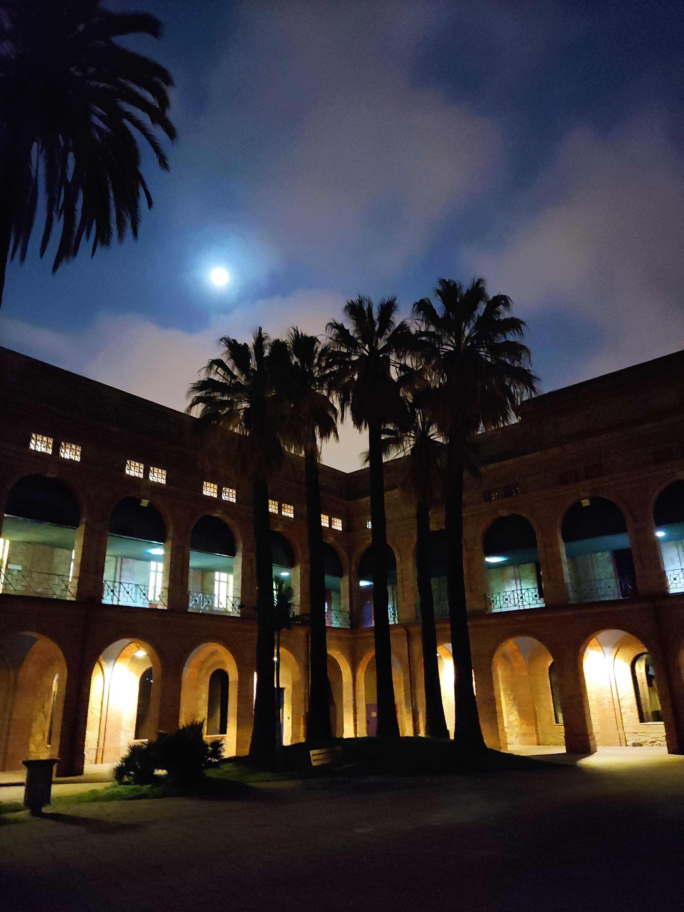
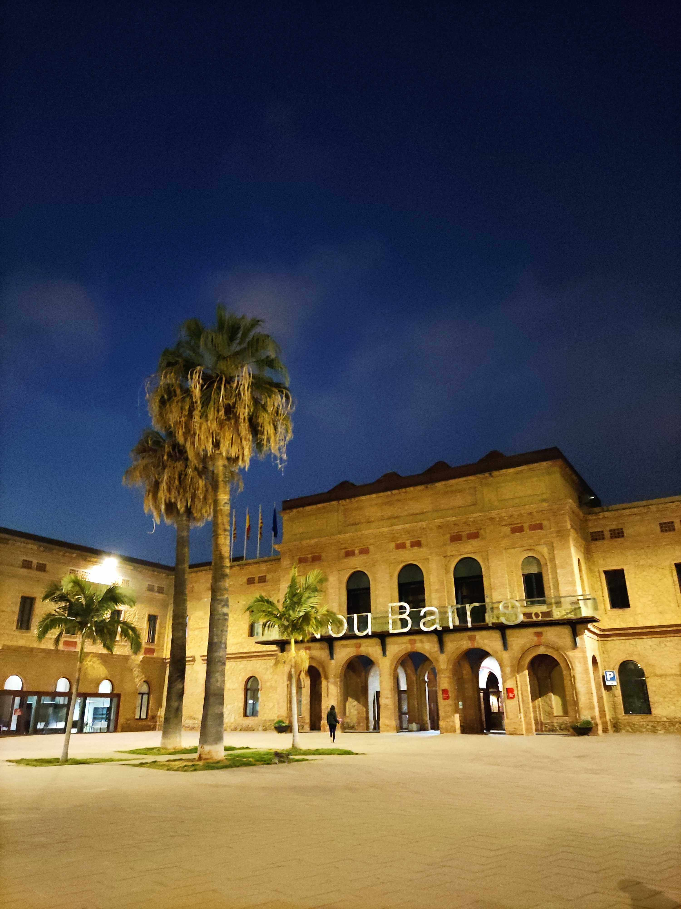
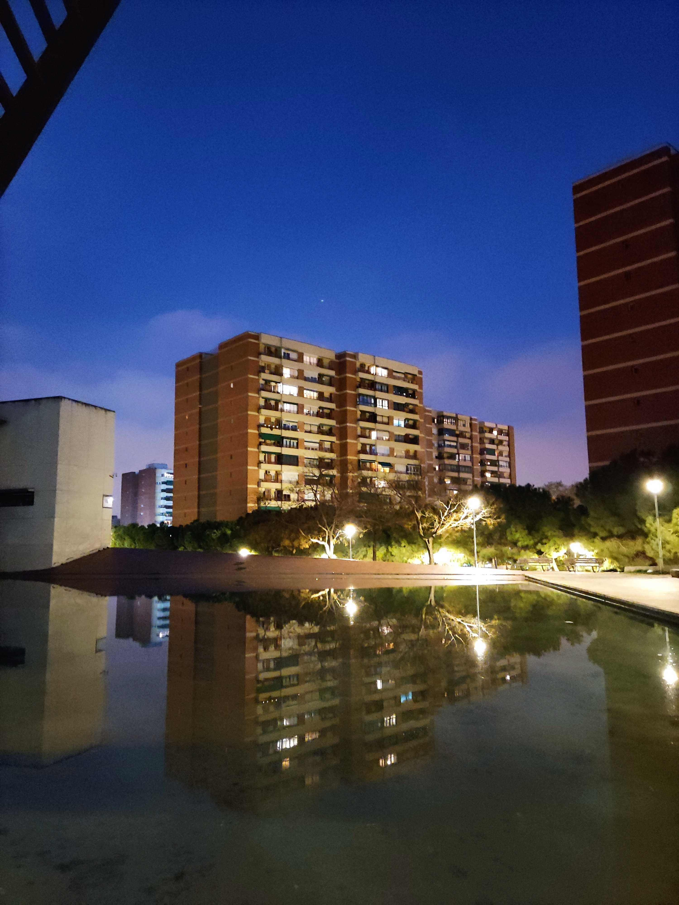
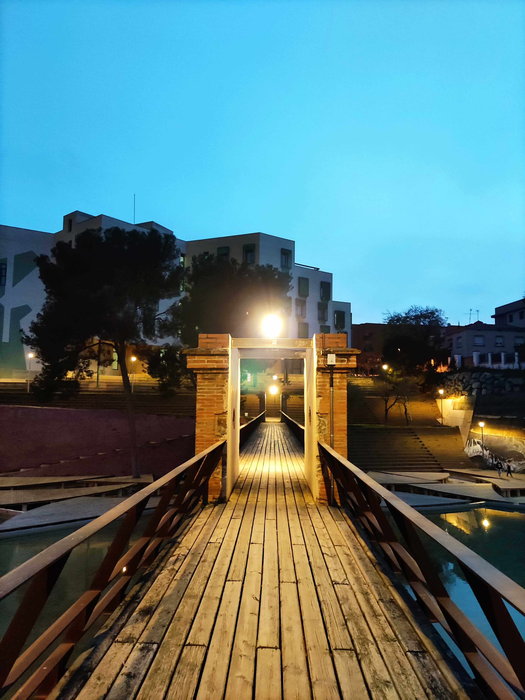
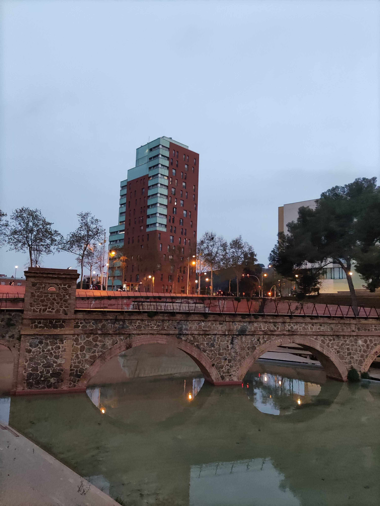
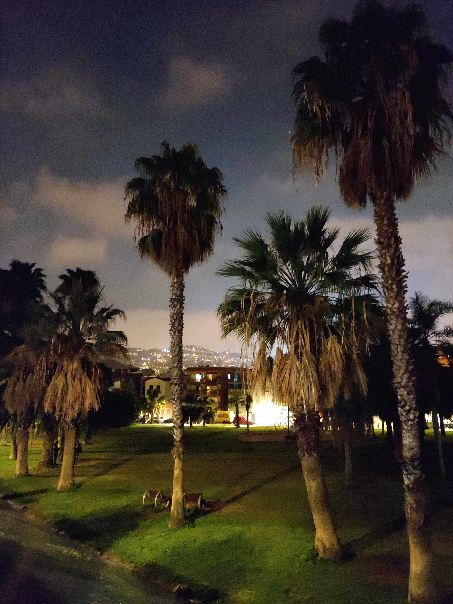
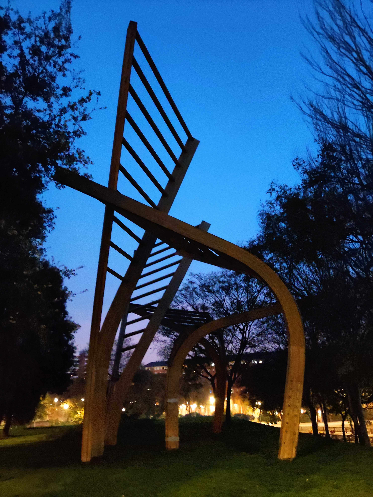
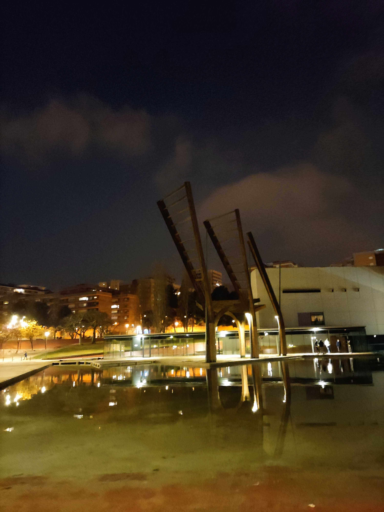

A long while ago I bought a book called 111 Please In Barcelona That You Mush Not Miss and decided to take the challenge to see all these places. Especially during these times when we are not allowed to travel outside of Barcelona, it seems the perfect thing to do.

Last night I picked no.78 **Parc Central de Nou Barris**. The park is located quite far from the center of Barcelona. But maybe this BCN far is not that far. I didn’t have many expectations about it until I read that it won the “Urban Landscape Award” in Frankfurt, Germany. The park was chosen from some 60 applications from Germany, the US, Mexico and my dream country Switzerland.

Thinking of the parks I’ve been to already in Barcelona I have to see I really like this one and for a few reasons. It’s a big one, to be more precise the 2nd largest Park in Barcelona after Parc Ciutadella! Has a lot of benches and green spots, is surrounded by some different newer architectural buildings. There are palm trees to be found but also olive trees and during the night especially has a magic touch.

If you ever visit this park I highly recommend going all the way down to the [Biblioteca Nou Barris](https://goo.gl/maps/q4Hjq1U8iFnfkxsQA) and enter the garden. It reminded me of being in Granada in a way. Anyhow, I think it’s time to see pictures.

