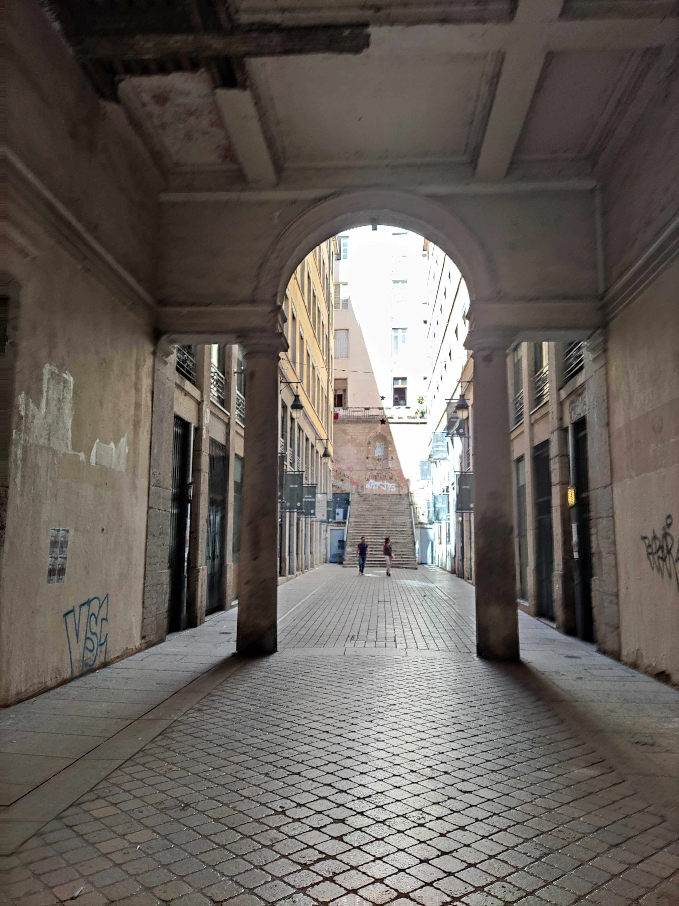
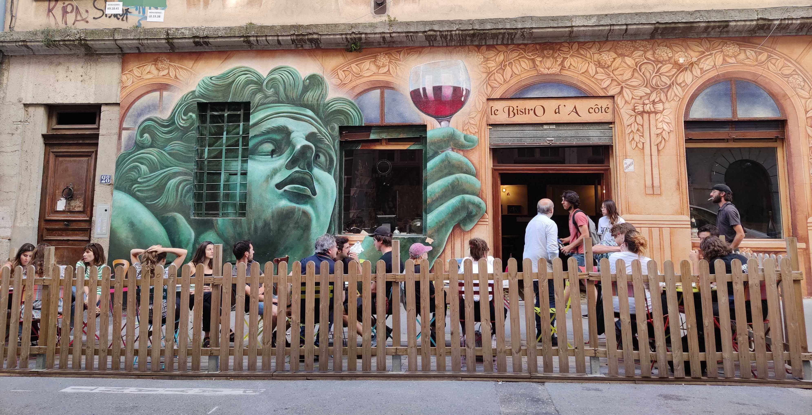

A few months ago I went on a solo weekend trip to Lyon. I booked a flight and a hotel and with no actual plan was ready for an adventure.

With half-day left after having walked around the top sightseeing spots, I decided to go up to the La _Croix_-Rousse neighborhood. At the tourist information desk, I've had someone mark some of the passageways around that neighborhood without really giving further information. I kinda ignored them and just wanted to go up to the hill and see the view.

On my way back down I spotted a sign on a building entrance that looked just very similar to the signs of the Camino de Santiago.

I peeked inside and saw this tall old gray abandoned apartment building and some stairs leading down. In this concrete interior building yard, I spotted a couple more tourists wandering around. They were looking at a sign and I went down to have a look too. I don't really remember what it said, I think it was in French. I got super curious to see what could be found at the lower level.

Image: Famous traboule on Croix-Rousse hill: the “Cour des Voraces”

Downstairs it was dark and empty. In a way it reminded me of Bucharest and although I felt scared I continued walking down. I ended up at the interior entrance of another building where I saw a lot of sprayed post boxes. I wasn't sure if I should be here and wanted to leave fast. Going all the way back up felt too tiring so I decided to walk outside. I looked on my right and saw some people at a window up and decided to quickly walk the other way. Luckily it didn't take long and I reached again the street.

Quickly I took out my map to check where I was just to realize that I walked through one of the marked passageways. As I was on my way down I decided to continue through this hidden labyrinth.

By walking through these passageways I've observed a lot of art up the walls and some abandoned shops of the creator's village (Village des Créateurs). This is called Passage de Thiaffait. Ok, maybe they were just closed as it was a Sunday.

This was my favorite part of the trip to Lyon, an unexpected detective adventure I've shared with other tourists. To enter some of the passages you had to open a door and walk through the darkness, others were less hidden. Here are some pictures from the spots.

Image: Passage de Thiaffait

To make it easier to find the spots I've created a <a class="articleLink" href="https://www.google.com/maps/d/u/0/edit?mid=1XD5OSGiUPT6XZbBuUgCKGyFmKnW50v73&usp=sharing">Google map </a>where I've marked these as well as other of the places I recommend visiting while in Lyon.

Enjoy!
 
 

<iframe src="https://www.google.com/maps/d/u/0/embed?mid=1XD5OSGiUPT6XZbBuUgCKGyFmKnW50v73&ll=45.76635419222272%2C4.829192569836458&z=15" width="640" height="480"></iframe>

 

---

If you are curious to know more about the history of Lyon's traboules I recommend listening to this 5 min long explanation.
 
 

    <iframe src="https://open.spotify.com/embed/episode/4cNhFh1T27BJlHtY002FCM?utm_source=generator&theme=0" width="100%" height="152" frameBorder="0" allowfullscreen="" allow="autoplay; clipboard-write; encrypted-media; fullscreen; picture-in-picture"></iframe>

