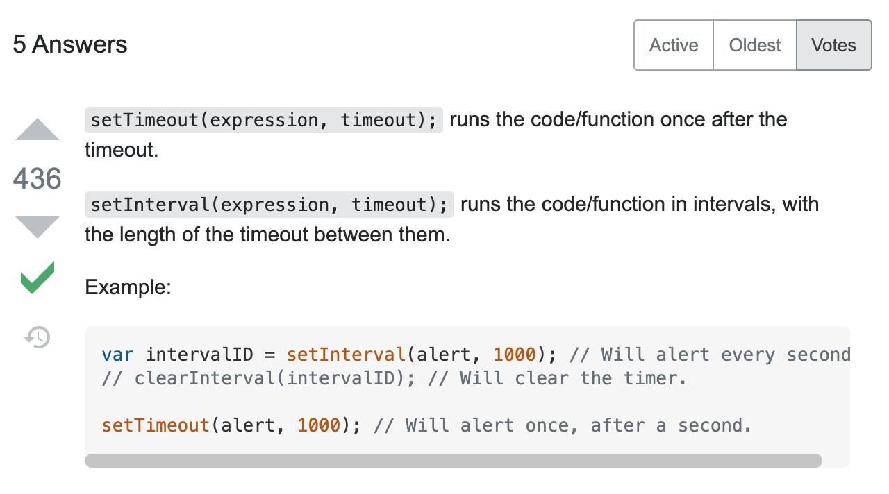

Until now I was only using setInterval not being aware of setTimeout. To be transparent I didn't need to use it until working on the [Speed Writing Game](https://stefi.codes/speed-typing-game/) Here's where setTimeout made a difference. I could have gotten way using setInterval for what I needed but it would have meant writing more code unnecessarily.   

My approach with setInterval looked like this:  

<pre class="line-numbers" style="max-width=300px; background: #352d39; color:#e3f4f5; font-family: Open Sans,sans-serif">
  <code class="language-css">
  useEffect(() => {
    const interval = setInterval(() => {

      setTimeRemaining(prevState => {
        if (prevState !== 0) {
          setTimeRemaining(prevState - 1)
        } else {
          setTimeRemaining(0)
        }
      })

    }, 1000)
    return () => clearInterval(interval);

  }, []);
    </code>
</pre>

Below the same thing but with using `setTimeout`

<pre class="line-numbers" style="max-width=300px; background: #352d39; color:#e3f4f5; font-family: Open Sans,sans-serif">
  <code class="language-css">
  useEffect(() => {

    if (timeRemaining > 0) {
      setTimeout(() => {
        setTimeRemaining(prevTime => prevTime - 1)
      }, 1000)
    }
  }, [timeRemaining])

    </code>
</pre>

So you might want to know about difference between setTimeout and setInterval and not just look at my code. 

TL;DR: `setInterval` fires again and again in intervals, while `setTimeout` only fires once.

`setTimeout`  

setTimeout is a time-based code execution method that will execute the script only one time when the interval is reached, and not repeat again unless you gear it to loop the script by nesting the setTimeout object inside of the function it calls to run. If geared to loop, it will keep firing at the interval unless you call clearTimeout().  

`setInterval`

setInterval is a time interval based code execution method that has the native ability to repeatedly run the specified script when the interval is reached. It will keep firing at the interval unless you call clearInterval().

[Source StackOverflow](https://stackoverflow.com/questions/2696692/setinterval-vs-settimeout)
