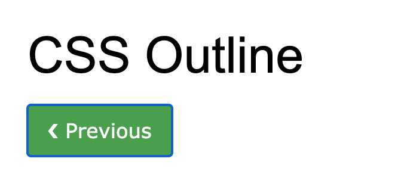
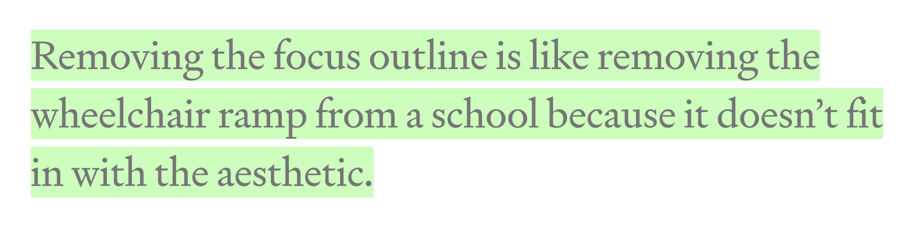

I’ve learned this thanks to the fact that I’ve shared learning about `outline: 0`. I was quite annoyed by the blue ring around my buttons whenever they were clicked but didn’t spend much time looking into it. I’m not a designer so I let it go easily.

While working on some tutorials I discovered the `outline: 0` option and was excited to share it. The moment I did luckily [Germinal](https://twitter.com/germicamps), Lead Instructor at [CodeOp](https://codeop.tech/), made me aware of what a big mistake doing this is. Removing that blue border that tells you that you’ve clicked on something, that you obviously know you’ve just clicked on, has consequences for those who won’t browse your site by simply clicking on buttons. Even though I did a course on web accessibility and I am trying to be very mindful about it, sometimes I happens that I make mistakes and I am open to correct them.

Not everyone is browsing the web like I do. Some rely on their keyboard. Therefore by removing that outline when a users hits the tab key they cannot really see/know if the button is selected or not. This is not fair and there are some easy ways to fix it.

My approach was to add a focus ring that has a brighter nuance (hue) of the background color of the button. Alternatively you could change the background color on click.

Here's a demo of what I did:

  See the Pen <a href="https://codepen.io/stefi23/pen/abmpGYz">
  Buttons example</a> by Stefi Rosca (<a href="https://codepen.io/stefi23">@stefi23</a>)
  on <a href="https://codepen.io">CodePen</a>.

I've used added `box-shadow` to the focus.

<pre class="line-numbers" style="max-width=300px; background: #352d39; color:#e3f4f5; font-family: Open Sans,sans-serif">
  <code class="language-css">
    .btn-blue:focus {
        outline: 0;
        box-shadow: 0 0 0 3px #91CBED;
        border-radius: 2px; 
    }   
  </code>
</pre>

There are different alternatives to this for which you'd use Javascript. I recommend checking these:

- One from [David Gilbertson
  ](https://medium.com/hackernoon/removing-that-ugly-focus-ring-and-keeping-it-too-6c8727fefcd2)
- Another one from [Alice Boxhall](https://www.oreilly.com/content/proposing-css-input-modality/)

Hope this was useful.

I'll leave you with another discussion around [graying out or not disabled buttons](https://uxmovement.com/buttons/why-you-shouldnt-gray-out-disabled-buttons/)

If you think this was useful [let me know](https://twitter.com/Stefania_Rosca).

Thank you!

[Image Source](https://medium.com/hackernoon/removing-that-ugly-focus-ring-and-keeping-it-too-6c8727fefcd2)
