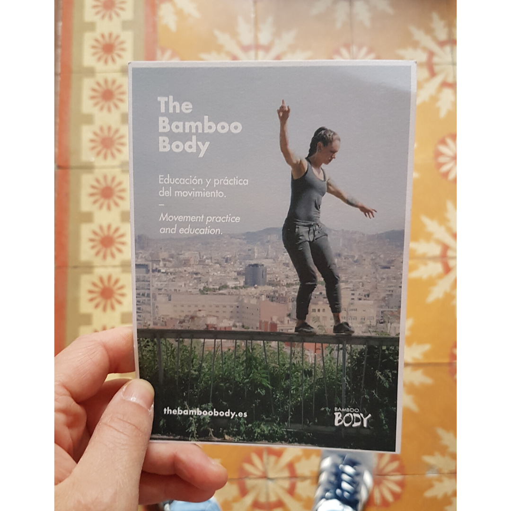
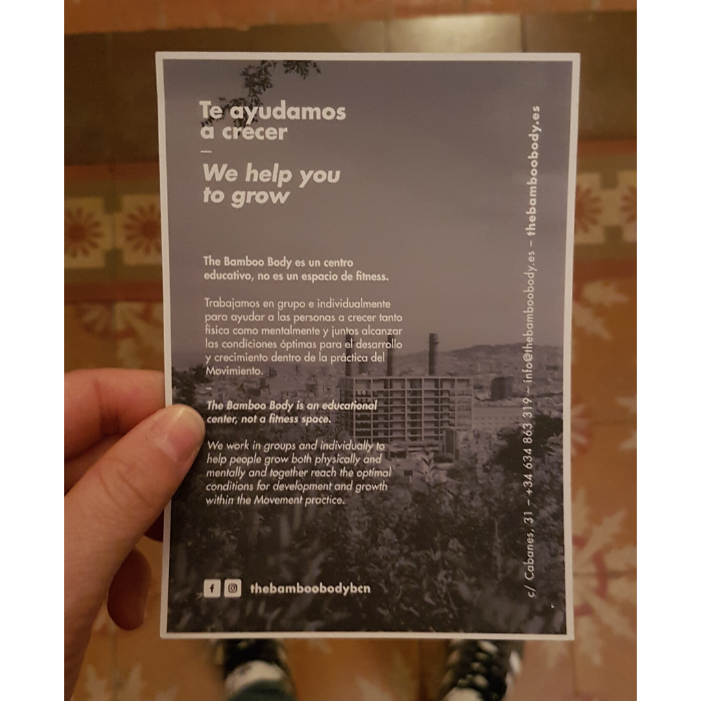

One of the question, Tim Ferriss asks the people he interviews on his [podcast](https://tim.blog/podcast/) is: “What purchase of \$100 or less has most positively impacted your life in the last six months?”

My answer: <a href="https://www.instagram.com/thebamboobodybcn/"> **The Bamboo Body** </a>

For more than 2 years I wanted to join the Bamboo Body. [Oz](https://www.instagram.com/ozana_bk/) told me all about it multiple times but I never found the time to go. I either had Spanish classes or couldn’t make it due to my work schedule. Now that I don’t work anymore it was time to make it happen. When I found out about the price I wanted to postpone it. 100 euros per month is definitely out of my current budget. I want to be able to study more before I start working again, therefore making responsible purchases while living on my savings is my priority. While talking to Oz in December I figured that once I will start working and have more money I might not have the time so it would be better to reconsider the way I spend my money and give it a try in January. As the day we would go was approaching I was secretly hoping that she will forget and not mention it 🙈

As she didn’t, I tried to bring up more excuses, I was complaining about the fact one has to go at least 3 times per week and that one session takes two hours. This meant I might not be able to train for the half marathon which happens next week and that some of my mornings will be spent training instead of coding. I do sports almost every day. It’s either running or yoga but all this doesn’t take more than 1h as everything is done in the proximity of my home.
After a month of going to the Bamboo Body, I can truly say that I’m happy with the decision to go. Not only do I feel better physically but also mentally. The Bamboo Body is not your typical gym. I can’t even really call it a gym. To me it’s more a place to explore and move, to ask yourself questions and discover more of yourself. A place where you get to work with people of all levels and cultures who will push you to grow together with Anna who is a great leader. She will definitely get you out of your comfort zone.

The first couple of weeks were difficult and I got home exhausted. Later on, I still feel tired but at the same time, I feel mentally refreshed. Not sure how to actually explain it. What I didn’t expect to happen is the fact that I can better focus on work and studying. My sleep is strangely improving and I got to rethink some well-grounded beliefs. Maybe I take some of the things in a more philosophical way, I don’t know.
Discovering how my body is connected to my mind and emotions as well as breaking down different parts of my body is a challenging and exciting journey.
If you are curious to discover the world of movement I recommend joining @thebamboobodybcn , the place to reshape your practice, as written on their website.
Tomorrow is the last day to enroll for February.

Thank you, **[Oz](https://www.instagram.com/ozana_bk/)** ❤️

More info at **[thebamboobody.es](https://www.thebamboobody.es/eng)**

