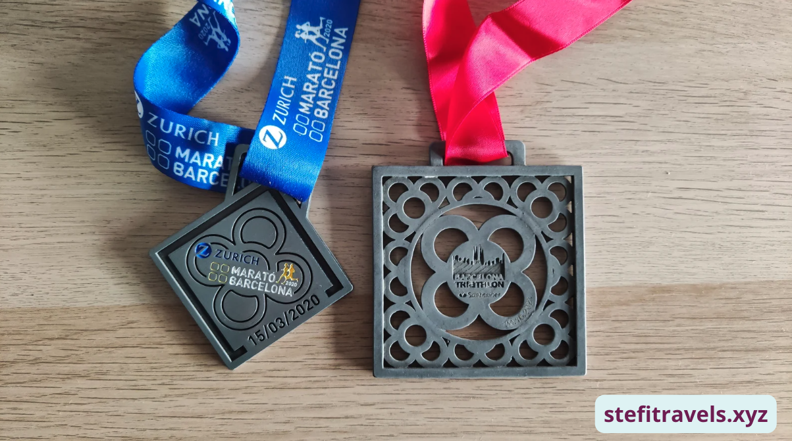
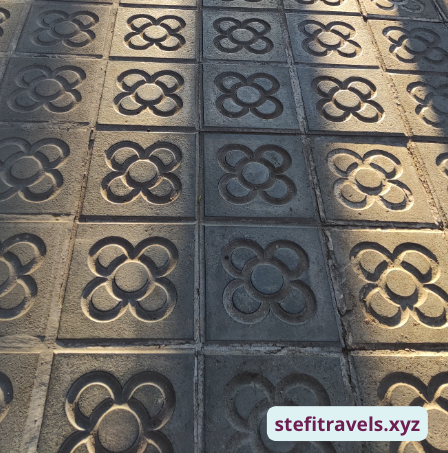
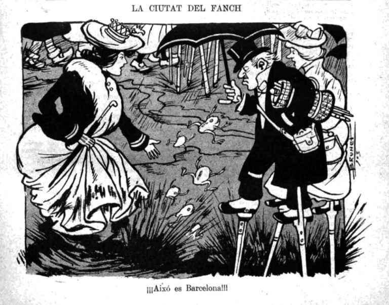
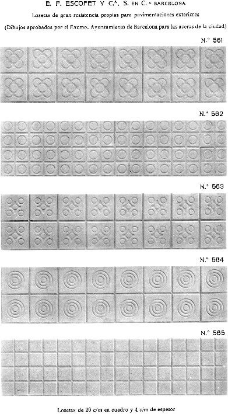
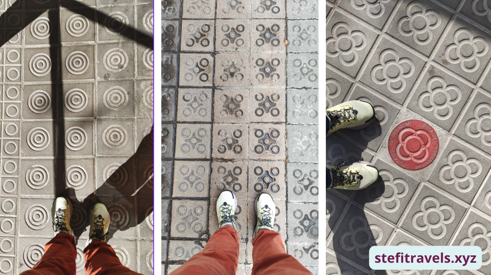
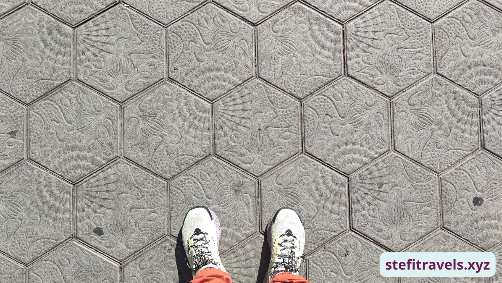
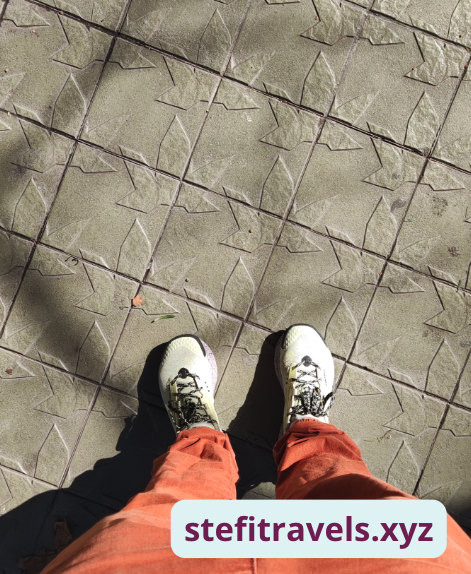
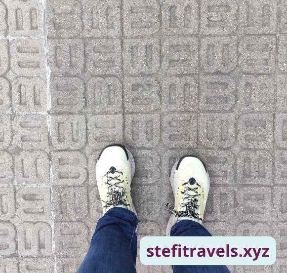

If you've ever wandered the streets of Barcelona, chances are you've encountered the panot – that special tile decorated with a pretty flower. flower. Due to its popularity, it has started being used in many ways like souvenirs, clothing, logos, medals, jewelry, and some people even get a tattoo of it.

It has become an iconic image that is everywhere, but most importantly on the streets of Barcelona. Do you know how it came to be and the history of **Can Fanga,** the house of mud?

## Uncovering the Origin Story

It’s hard to believe, given the fact that it barely rains nowadays, that at the beginning of the 20th century, this city was called the House of Mud. Every time it rained, the streets were filled with mud due to improper street surfacing. If you left the house clean, you would arrive home dirty and covered in mud, as there was no way around it, even on the popular street Passeig de Gracia.

It got so bad that there were comics about this making fun of the city and the people of Barcelona.

[Image source](https://raco.cat/index.php/TreballsComunicacio/article/view/243111/325780)

Up until the early 20th century, homeowners in Barcelona were responsible for paving outside their own houses. As a result, the pavements – where they were even bothered to be built – were often uneven, patched together with cement and asphalt.

</img>
[Source: El Boig de Can Fanga (@BoigBCN) - January 12, 2024](https://twitter.com/BoigBCN/status/1745769078126416026)

</img>
[Image source](https://historiesdebcn.com/can-fanga-quan-barcelona-era-la-ciutat-del-fang/)

## From Mud to Masterpiece

Luckily the local government stepped in and approved to standardize the sidewalks and so the paving project started. <a href="https://www.escofet.com/en" target="_blank" class="articleLink">Casa Escofet</a>, an architectural firm, won a competition to design the panot, which became a defining feature of Barcelona's streets.

 

## The Mystery of Design

While the panot's origins are well-documented, the identity of its designer remains a mystery. Casa Escofet presented five designs to the Eixample Commission,
and won the project. They started paving the streets of Barcelona with the design of the panot, becoming one of the most emblematic symbols of the city.

Some speculate that renowned Catalan architect Josep Puig i Cadafalch played a role, drawing inspiration from the almond flower motif of his iconic Casa Amatller. However, conclusive evidence remains elusive, adding to the panot's enigmatic allure.

TODO!! -> Add image Casa Amettler + Almond Flower

If you are curious to know the panots are made out of cement, sand and water and measure 20x20 cm. These *panot* tiles cover around five million square meters of pavement in Barcelona.

Anyone visiting the city will inevitably walk on a *panot* tile at some point during their stay.

Interestingly, the panot - the Flor de Barcelona is often attributed to the famous Catalan architect Josep Puig i Cadafalch. The flower design is said to have been a copy of the one he instated in the entrance of his Modernist mansion Casa Amatller. Amatller was a chocolate owner and the flower was to depict an almond flower as chocolate goes well with almonds. However, there is a lot of debate on it and we will probably never know the truth.

 

## Bonus

**<u>Gaudí’s Panot:</u>** Another emblematic design is Gaudí’s Panot present on the popular Passeig de Gràcia street. His nautical-themed *panot* is etched with three different marine species: starfish, ammonoid mollusks and seaweed. Originally intended for Casa Batlló's floors, it found its place outside the building due to manufacturing delays.

**<u>Panots on Diagonal:</u>** On Diagonal street, there's a new panot with banana tree leaf designs.

**<u>‘B for Barcelona’ Panot:</u>** In 2008, there was an initiative to make a new type of tile called the 'B for Barcelona' panot. They wanted to use it all over the city in new construction work. Before the decision was made they set it out on Ganduxer Street, but people didn't like it much, so they stopped the project. You can still see some of these tiles on Ganduxer Street today in front of the Centre Civic Pere Pruna.

In general, it is best to look up, but while in Barcelona have a peak on where you’re stepping you might discover other panot styles.
