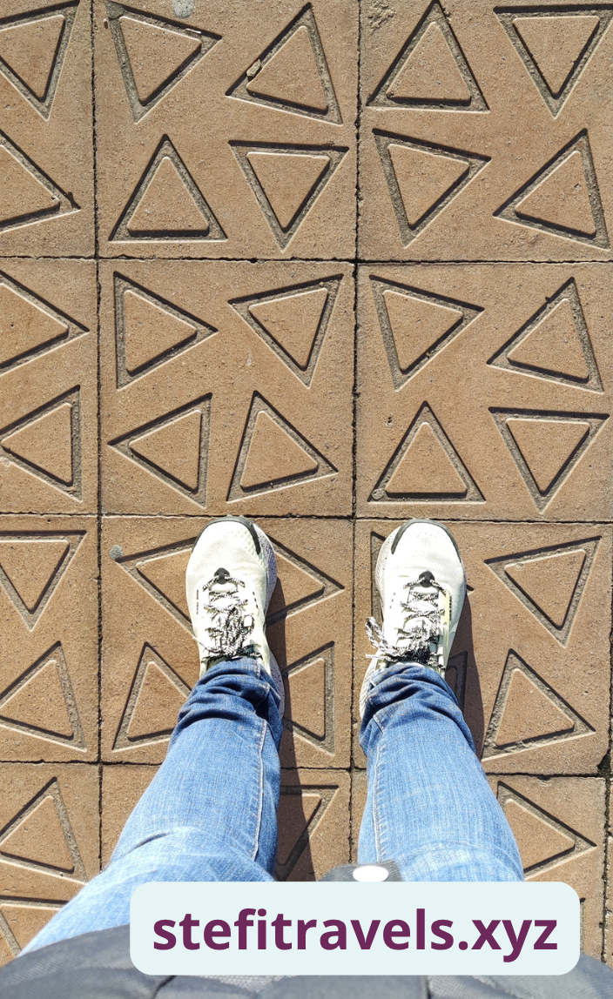

If you've ever wandered the streets of Barcelona, chances are you've encountered the panot – that tile with a flower on it. Due to its popularity, it has started being used in many ways like souvenirs, clothing, logos, medals, jewelry, and some people even get a tattoo of it.

It has become an iconic image that is everywhere, but most importantly on the streets of Barcelona. Do you know how it came to be and **<u>the history of Can Fanga, the house of mud</u>**? If not just keep reading ✨

 

## Uncovering the Origin Story

It’s hard to believe, given the fact that it barely rains nowadays, that at the beginning of the 20th century, this city was called the House of Mud. Every time it rained, the streets were filled with mud due to improper street paving. If you left the house clean, you would arrive home dirty as there was no way around it, even on the popular street Passeig de Gràcia.

It got so bad that there were comics about this making fun of the city and the people of Barcelona.

[Image source](https://raco.cat/index.php/TreballsComunicacio/article/view/243111/325780)

Up until the early 20th century, homeowners in Barcelona were responsible for paving outside their own houses. As a result, the pavements – where they were even bothered to do them – were often uneven, patched together with cement and asphalt. It was quit messy.

</img>
[Source: El Boig de Can Fanga (@BoigBCN) - January 12, 2024](https://twitter.com/BoigBCN/status/1745769078126416026)

</img>
[Image source](https://historiesdebcn.com/can-fanga-quan-barcelona-era-la-ciutat-del-fang/)

 

## From Mud to Masterpiece

Luckily the local government stepped in and approved to standardize the sidewalks and so Barcelona's paving project started. <a href="https://www.escofet.com/en" target="_blank" class="articleLink">Casa Escofet</a>, an architectural firm, won the competition to design the panots/tiles, which became a defining feature of Barcelona's streets.

 

## The Mystery of Design

While the panot's origins are well-documented, the identity of its designer remains a mystery. Casa Escofet presented five designs to the Eixample Commission, and won the project. They started paving the streets of Barcelona with the design of the flower panot, becoming one of the most emblematic symbol of the city.

**Some speculate that renowned Catalan architect Josep Puig i Cadafalch played a role**, drawing inspiration from the almond flower motif of his iconic build Casa Amatller (Tip: this house is next to Casa Batlló and because it's less popular it's such an enjoyable visit which also includes a free sample of chocolate.).

Amatller owned a chocolate business, and the flower represented an almond blossom since chocolate pairs nicely with almonds. However, there is a lot of debate on it and we will probably never know the truth.

If you are curious to know the panots are made out of cement, sand and water and measure 20x20 cm. These panots cover around five million square meters of pavement in Barcelona.

Anyone visiting the city will inevitably walk on a panot at some point during their stay. So walk with caution not to miss them.

 

## Bonus

**<u>Gaudí’s Panot:</u>** Another emblematic design is Gaudí’s Panot present on the popular Passeig de Gràcia street. His nautical-themed *panot* is decorated with three different 🌊 marine species: starfish, ammonoid mollusks and seaweed. Originally intended for Casa Batlló's floors, it found its place outside the building due to manufacturing delays.

**<u>Panots on Diagonal:</u>** On Diagonal street, there's a new panot with 🍌 banana tree leaf designs.

**<u>‘B for Barcelona’ Panot:</u>** In 2008, there was an initiative to make a new type of tile called the 'B for Barcelona' panot. They wanted to use it all over the city in new construction work. Before the decision was made they set it out on Ganduxer Street, but people didn't like it much, so they stopped the project. You can still see some of these tiles on Ganduxer Street today in front of the Centre Civic Pere Pruna. This is quit far from the center and not sure it's worth a walk up if you are here just for a few days.

In general, it is best to look up, but while in Barcelona try to also have a peak on where you’re stepping as you might discover other panot styles as I did.

That's all for today! Thanks for reading until the end 👋
