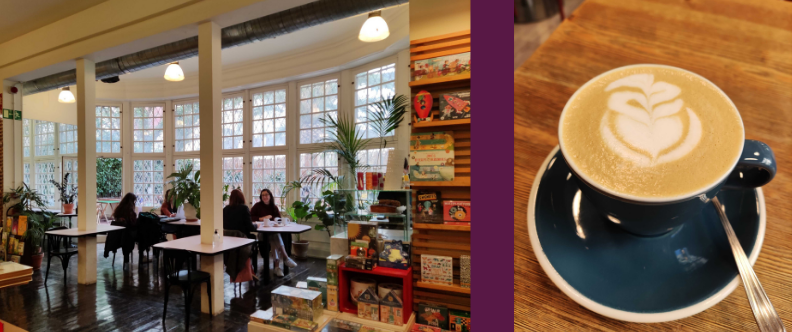
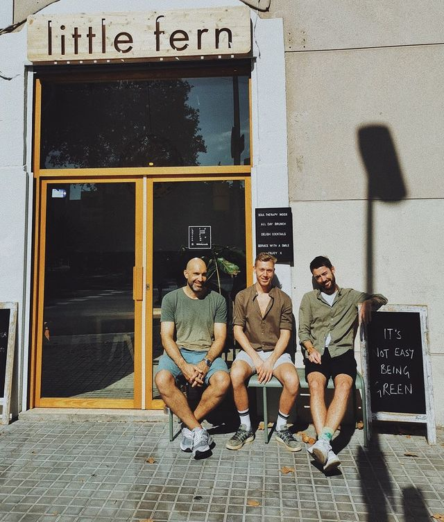
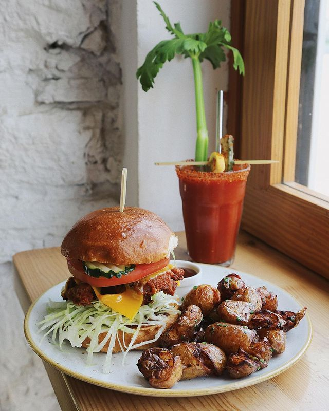
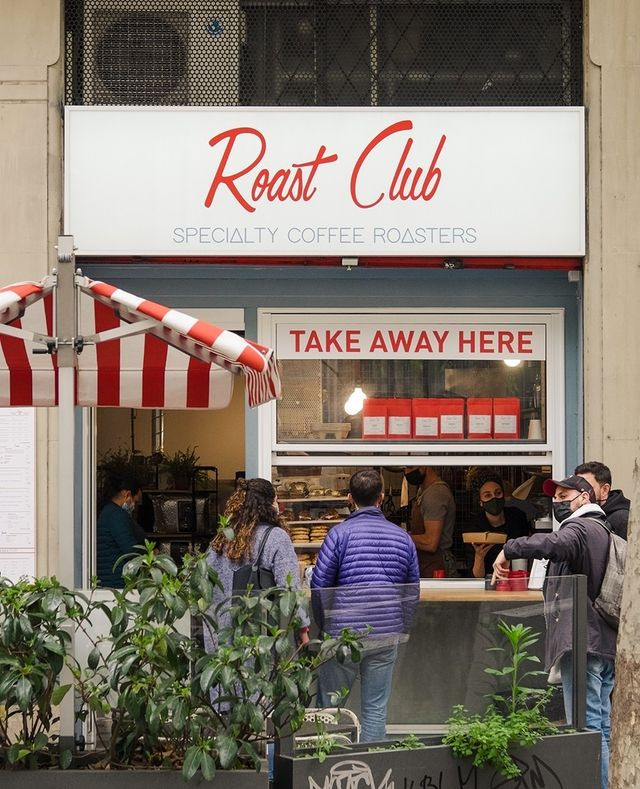
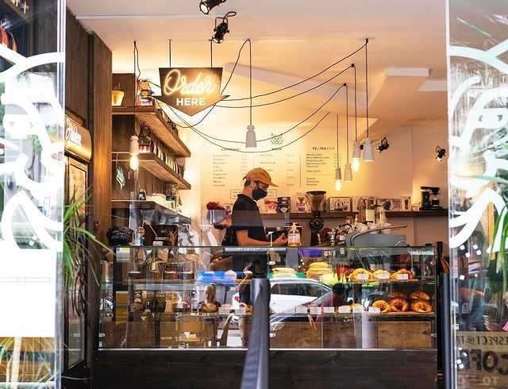
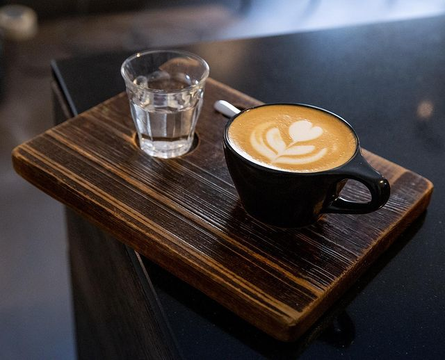
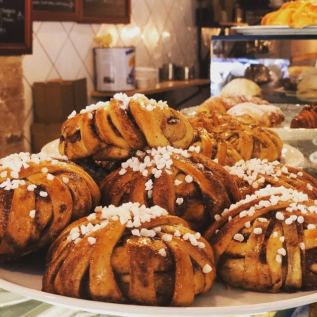
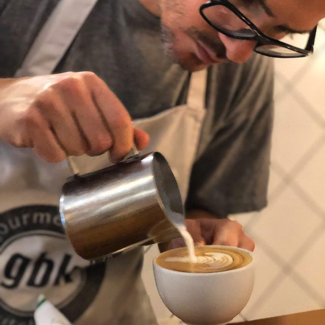
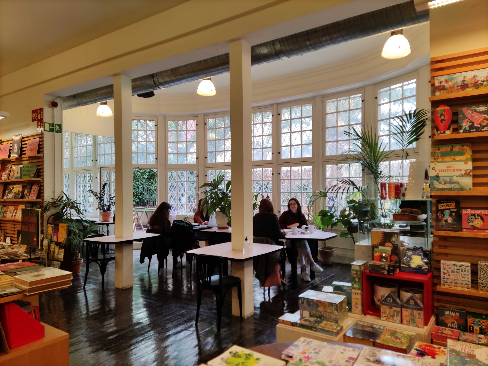

As someone who loves specialty coffee and has been living in Barcelona for the past 5 years, I want to share with you my favorite roastery coffee spots and as well as why I recommend them.

Let’s get into it.

    <iframe src="https://www.google.com/maps/d/embed?mid=1hOmCCQAts5kPgmnzstJUN82UzDkMzyBK&hl=en&ehbc=2E312F" width="640" height="480"></iframe>

 

## 1. Little Fern

    <a href="https://g.page/littlefern?share" target="_blank" class="articleLink">C. de Pere IV, 168, 08005 Barcelona</a>

<b>Opening Hours:</b> Mon-Sun: 9AM–4PM   
<i>These times might change please double check.</i>

Little Fern is a coffee shop and brunch place located in Poblenou, also known as 22@ Barcelona Innovation District.

Pre-pandemic I used to get my coffee here daily. As an expat, I had a hard time integrating in Spain and the work culture and thankfully I had this lovely place to go for a little chat. Nick and the rest of the staff are wonderful people who'll make you smile even on a rainy day. If you go when they open you might catch them dancing while prepping the space.

You'll know you've arrived at the right place if you spot at the entrance a blackboard that greets with a motivational or fun message.

Source: <a class="articleLink" href="https://www.instagram.com/p/B2M0gtio4Z2">Instagram Little Fern</a>

Little Fern is a plant-based brunch place where you can eat a variety of delicious dishes. The Rey Reay Burger with a crispy fried vegan buttermilk oyster mushrooms and mustard sauce is my personal favorite.

During weekends the place is a bit more crowded as a lot of people stop by before heading down to the beach.

Source: <a class="articleLink" href="https://www.instagram.com/p/COUtmJ8Bwfs">Instagram Little Fern</a>

## 2. Roast Club Cafe

    <a href="https://www.google.com/maps/place//data=!4m2!3m1!1s0x12a4a321ff201c1b:0xaf913d5e8e81d366?source=stefi.xyz" target="_blank" class="articleLink">C/ de València, 190, 08011 Barcelona</a>

<b>Opening Hours:</b> Mon: closed, Tue-Fri: 8:30AM–7PM, Sat-Sun: 9AM–7PM 
<i>These times might change please double check.</i>

Roast Club Cafe is a cute little coffee shop in Eixample. Once you enter you might be greeted with a warm "Ciao Bella" by the Italian owner. The whole space is open which means you can see the staff making your coffee or brunch. If you decide to stay you will feel the local vibe as you spot people come in and out while having chats with the baristas. Even though you are new the baristas will also chat with making you feel like a local.

Besides great coffee here you can find delicious cakes and breakfast food. Their avocado toast is one of my favorites.

Source: <a class="articleLink" target="_blank" href="https://www.instagram.com/p/COScWyBAZwM">Instagram Roast Club Cafe</a>

## 3. Hidden Coffee

    <a href="https://goo.gl/maps/GjHEwp9hg6F93FJx8" target="_blank" class="articleLink">C/ Constança, Carrer de Déu i Mata, esquina, 08029 Barcelona</a>

<b>Opening Hours:</b> Mon-Sun: 8AM–7PM   
<i>These times might change please double check.</i>

As the title tells this coffee shop is more "hidden" as it is not in a central area or more popular neighborhoods. Although they've now opened two other spots, one in El Born and one in Poble Nou, I will only talk about the one located in Les Corts.

In my personal top, the coffee here ranks no.1 and comes paired with a small glass of water.

The place is quite small with a few tables outside. I like getting coffee here as it is less loud and crowded. In case it's full there is a small park close by. On the weekends a lot of bikers come to grab a cup as they are heading out of back to town.

They have a big variety of sweets but not as much breakfast food as the rest of the places mentioned.

Source: <a class="articleLink" target="_blank" href="https://www.instagram.com/p/CJMORcAhOgh">Instagram Hidden Coffee Roasters</a>

Source: <a class="articleLink" target="_blank" href="https://www.instagram.com/p/CMWnZ1ShgHm">Instagram Hidden Coffee Roasters</a>

## 4. Manso's Cafe

    <a href="https://goo.gl/maps/8jkXXnaEmcE8hr38A" target="_blank" class="articleLink">Carrer de Manso, 1, 08015 Barcelona</a>

    <b>Opening Hours:</b> Mon-Sun: 8AM–7PM   
    <i>These times might change please double check.</i>

I don't go to as often to Manso's Cafe but highly recommend it. It's located in Sant Antoni, a really cool neighborhood with a lot of restaurants, pedestrian areas, and more coffee shops.

Besides great coffee here you will find delicious Swedish pastry, their cinnamon roll is just amazing homemade cake and a great variety of breakfast food.

Source: <a class="articleLink" target="_blank" href="https://www.instagram.com/p/B3FH74IIcE8">Instagram Manso's Cafe</a>

Source: <a class="articleLink" target="_blank" href="https://www.instagram.com/p/B4cENsKoLJN/">Instagram Manso's Cafe</a>

## 5. El Café De La Central

    <a href="https://goo.gl/maps/FXPLyMrt8AdmRTDF6" target="_blank" class="articleLink">C/ de Mallorca, 237, 08008 Barcelona</a>

    <b>Opening Hours:</b> Mon-Sat: 10AM–9PM, Sun: closed   
    <i>These times might change please double check.</i>

El Café De La Central can be found on the first floor of the La Central library. The coffee is the same as in the Satans coffee shops as it has the same owner and is less popular as not many people know of its existence. Once you enter you have to go upstairs and there is a quiet indoor terrace. Whenever I go I see people here studying, reading, or just having a chat.

They don't have wifi and since the pandemic, they are not serving food anymore, maybe a few snacks. If you wanna escape from the city while still being in the center this could be the place.

The coffee is a bit pricy 2.5 euro for a cafe con leche (coffee with milk) compare to 2 euro in the other places.

Tip: The Bar Central Raval from the library in Raval is bigger has a nice terrace and food options.

 

